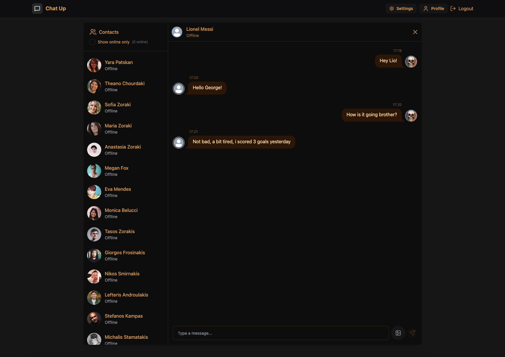
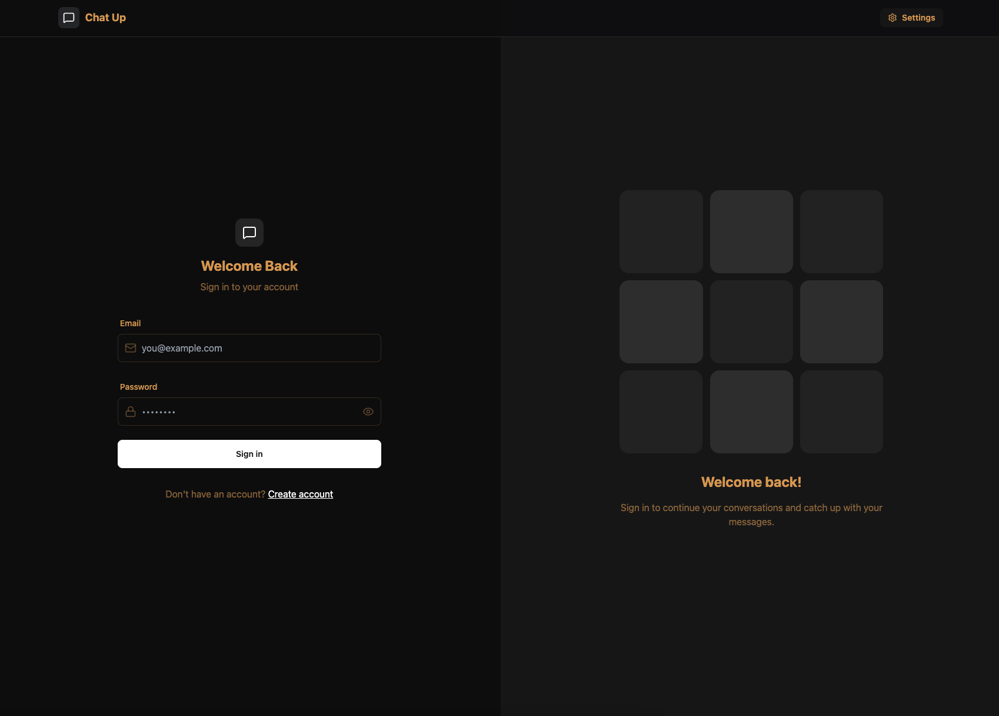
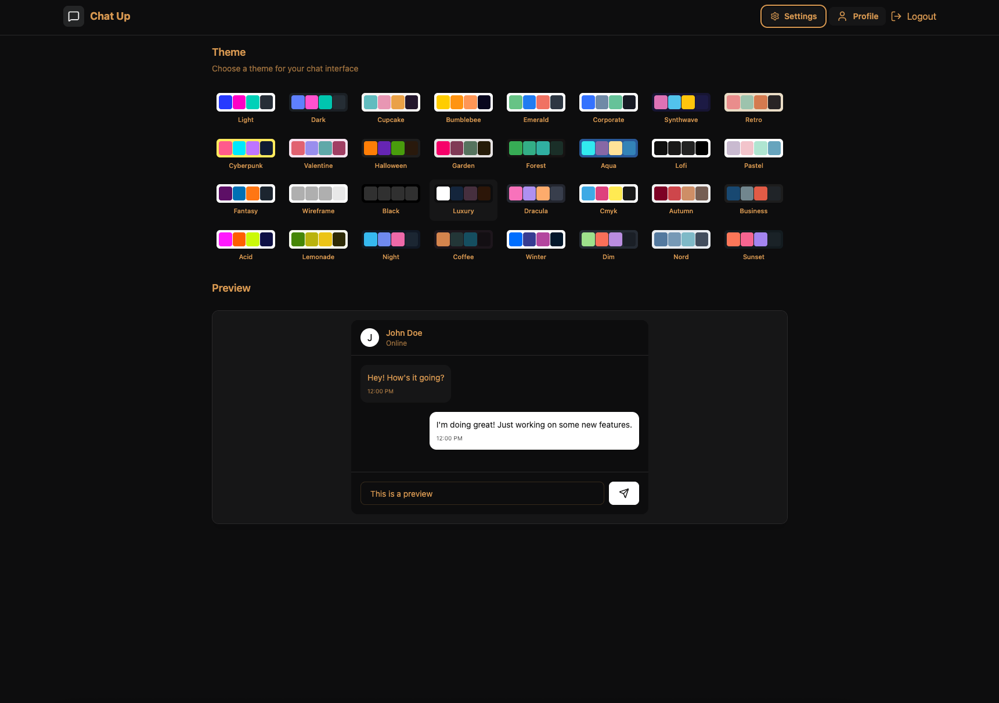
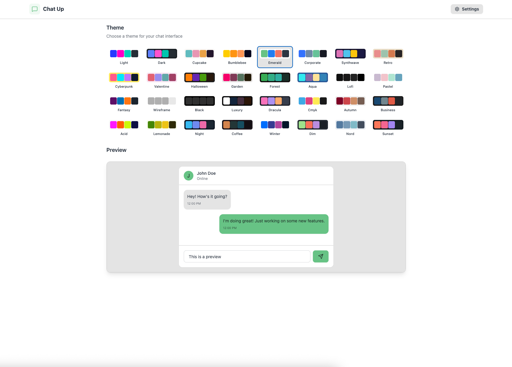

# 💬 Chat Up

          

A full-stack chat application where users can register, log in, upload profile pictures, and chat in real time. Built with a modern frontend powered by React + TailwindCSS + DaisyUI, and a robust backend using Node.js, Express, Socket.IO, and MongoDB, with Cloudinary for image storage.

[🌐 Visit the app](https://chat-up-1.onrender.com/login)

*Note: The app is deployed on Render.com, so it may take a couple of seconds to start when first loading.

## 📸 Chat

  

## ✨ Features

- 🔐 User Authentication (register, login, secure sessions)
- 💬 One-on-one real-time chat powered by Socket.IO
- 🖼️ Profile image uploads via Cloudinary
- 🎨 Responsive UI styled with TailwindCSS + DaisyUI
- ⚡ Fast development environment with Vite
- 🗄️ Persistent storage with MongoDB

## 🛠️ Tech Stack

Frontend:
- React
- TailwindCSS + DaisyUI
- Vite

Backend:
- Node.js
- Express
- Socket.IO
- MongoDB
- Cloudinary

Other:
- Authentication (JWT or Sessions)
- Modular and scalable folder structure

## 🏗️ Development Highlights

- Modular architecture for clean separation between frontend and backend
- Real-time WebSockets with Socket.IO for instant messaging
- Cloudinary integration for reliable profile image storage
- Reusable components with DaisyUI + TailwindCSS
- Environment-based configs for dev & production
- API testing with tools like Postman
- REST + WebSocket hybrid architecture for flexibility

## 📸 Login/Register

  

## 📸 Switch between 32 themes

  
  

